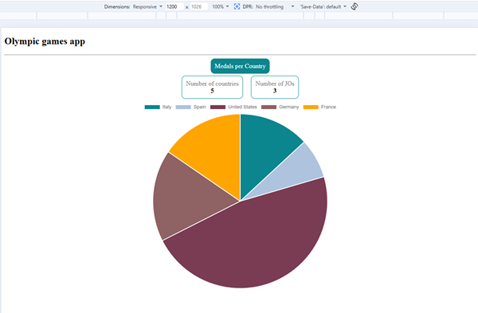
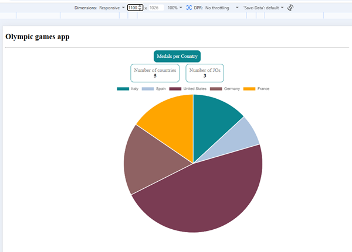
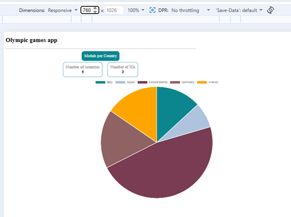
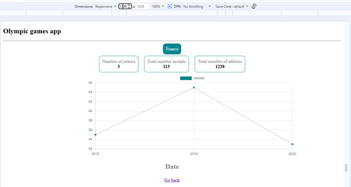
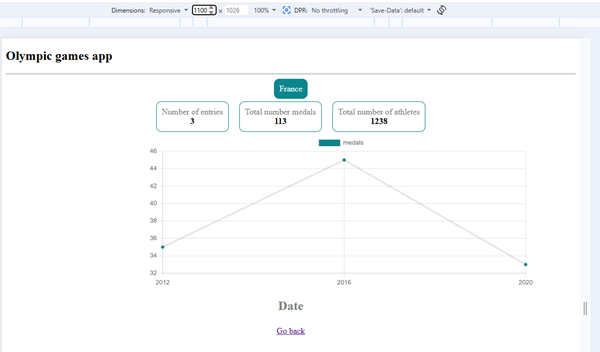
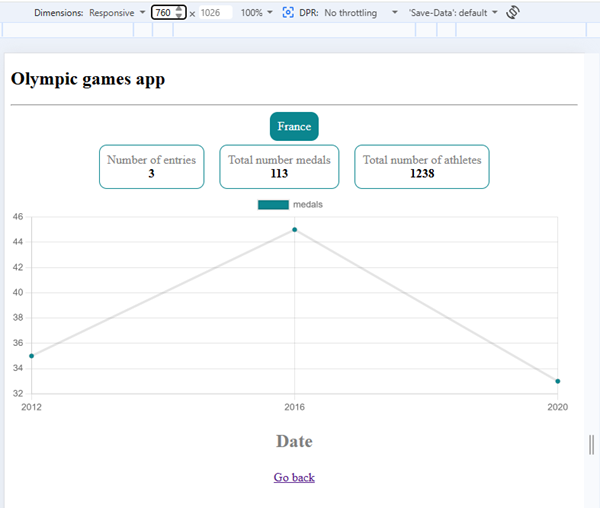

# Olympic Games App

## Sommaire
- [Présentation du projet](#présentation-du-projet)
- [Instructions de lancement](#instructions-de-lancement)
- [Structure du projet](#structure-du-projet)
- [Captures d’écran](#captures-décran)

---

## Présentation du projet

Application Angular permettant de visualiser les statistiques des Jeux Olympiques (médailles par pays, détails par pays, indicateurs globaux), à partir d’un fichier JSON de données.

---

## Instructions de lancement

### Prérequis
- Node.js (version recommandée : LTS)
- Angular CLI

### Installation
```bash
npm install
```

### Lancement
```bash
ng serve
```

###  Ouvrir un navigateur à l’adresse
```bash
http://localhost:4200
```

## Structures du projet

src/app/  
|-- components/  
|---- header  
|---- line-chart  
|---- pie-chartf  
|-- pages/  
|---- country/  
|---- home/  
|---- not-found/  
|-- core/  
|---- services/  
|---- models  

## Captures d'écran

### Home Page




### Country Page



